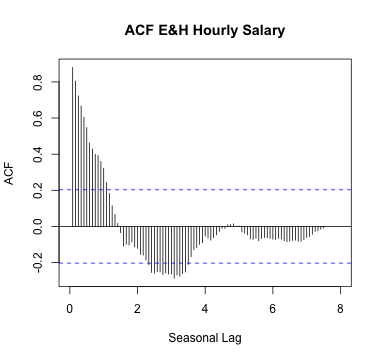

---
title       : TS Final Project
subtitle    : TN Health and Education Average Hourly Wage
author      : Xiang Liu (Dennis)
framework   : impressjs        # {io2012, html5slides, shower, dzslides, ...}
highlighter : highlight.js  # {highlight.js, prettify, highlight}
hitheme     : tomorrow      # 
widgets     : []            # {mathjax, quiz, bootstrap}
mode        : selfcontained # {standalone, draft}
knit        : slidify::knit2slides
github:
  user: XLdennis
  repo: TSProject
--- 


### <b>title</b> : TS Final Project
### <b>subtitle</b>  : TN Health and Education Average Hourly Wage
### <b>author</b> : Xiang Liu (Dennis)


--- .slide x:-2000 y:-1500
# Data Information
</br>
### __Data source__: [TN Federal Reserve Bank](http://research.stlouisfed.org/fred2/data/SMU47000006500000003.txt) 
</br>
### __Variable__: Average Hourly Earnings of All Employees: Education and Health Services in Tennessee 
</br>
### __Monthly Data__: 2007.1 - 2014.9 (93 monthly observations and roughly 7 year statistics)

--- .slide x:-1000 y:-1500

# Time Series Plot
 

<font size="3"> 
<p style="line-height:50%">
1. Time series seems to keep constant from 2007 until about the third quarter of 2010 where it makes a sharp spike. Then it keeps decreasing to be constant. </br>
2. Clearly, the mean does not remain constant which indicates that this series is nonstationary. </br>
3. Why there is a sudden jump in between 2010 and 2011. Is there any policy about education and health service made by then? Will this pattern appear again in the future?

--- .slide x:0 y:-1500

# Check Stationary Process
  

<font size="3"> 
<p style="line-height:50%">

- 1: Both ACF and PACF plots show signs that the E&H Salary data is nonstationary. 
- 2: This is suggested by a gradually trails off in the ACF and a very large at lag 1 in the PACF. 
- 3: Agmented Dickey-Fuller test also supports my thought. It's not stationary as the p-value = 0.6827, higher than 0.05, i.e., "Non-stationary" hypothesis cannot be rejected.

--- .slide x:1000 y:-1500

# Decomposition Process
 
<font size="4"> 
<p style="line-height:50%">

- 1: There is an inverse-U shape trend
- 2: We see strong seasonality

--- .slide x:2000 y:-1500

# Nonlinear Transformation
 
<font size="4"> 
<p style="line-height:50%">

- Since the 95% confidence interval include between -2 and 2, it suggests that the data isn't necessary to be transformed.

--- #ing x:850 y:3000 rot:145 scale:5

- It seems that  <b class="positioning">variance stablization</b> process isn't necessary 
- Will  <b class="positioning">differencing process</b> work? Let's find out^*

--- .slide x:6700 y:-300 z:0
# 1st Order Differencing
 
<font size="4"> 
<p style="line-height:50%">
- After 1st order differencing, the time series plot seem to be stationary (p-value = 0.01)
- The mean mean keeps to be constant over time and there is a little volatility in between 2010 and 2011 <b class="imagination">(my question)</b>

--- .slide x:6700 y:-290  z:-1500
# Seasonal Order Differencing
 
<font size="4"> 
<p style="line-height:50%">
- After 1st order differencing, the time series plot seem to be stationary. 
- After seasonal order differencing, the time series plot still looks non-stationary. 
- It seems to be unnecessary to take seasonal order differencing as also supported by the Augmented Dickey-Fuller test (p-value = 0.6027). 

--- .slide x:6700 y:-280 z:-3000
# Time Series Plot of Seasonality
  

<font size="3.5"> 
- it seems that January and Febrary are always higher than September and October. The monthly box-plot also supports this observation, which indicates seasonality and encourages me to try seasonal arima model to fit the data. 

--- .slide x:6700 y:-270 z:-4500
# Spectral Analysis
 
<font size="4"> 
<p style="line-height:50%">
- After I detrend the data. A long cycle of 46 months still exists. 
- There is a shorter spike at 12 month period and another in between them. 

--- #big x:3500 y:2100 z: 3000 rot:180 scale:5
<b>Next Step</b> <span class="thoughts">Let's fit an Arima model</span>

--- .slide x:2825 y:2325 scale:2
# ACF and PACF
  

--- .slide x:2825 y:2325 z:-3000 
# Model Specification

```
   AR(p) SAR(P) SMA(Q)       AIC       BIC
1      0      0      0 -1.826375 -2.826375
2      0      0      1 -1.837187 -2.809954
3      0      0      2 -1.828474 -2.774010
4      0      1      0 -1.844929 -2.817697
5      0      1      1 -2.003494 -2.949029
6      0      1      2 -1.996721 -2.915024
7      0      2      0 -1.837379 -2.782914
8      0      2      1 -1.999276 -2.917579
9      0      2      2 -2.001515 -2.892586
10     1      0      0 -1.839829 -2.812597
11     1      0      1 -1.851933 -2.797468
```
<font size="4"> 
- According to AIC and BIC, the best model is SARMA(1,1) model with 1st order differencing. Let's do time series diagnose.

--- .slide x:2825 y:3325 z:-3000
# Model Diagnose
 

--- #one-more-thing x:2825 y:3325 z:-3010 roty:5
# Statistics

```
      sar1       sma1 
 0.9977296 -0.9645097 
```
<font size="4"> 
<p style="line-height:50%">
- both seasonal factors are significant to be included in the model

--- .slide x:2345 y:2825 z:-2500 rot:30 
# AR(1) & SAR(1) 
 

--- #one-more-thing2 x:2345 y:2825 z:-2510 rot:30  roty:5
# Statistics

```
       ar1       sar1 
-0.1825479  0.1913842 
```
<font size="4"> 
<p style="line-height:50%">
- both seasonal factors are significant to be included in the model

--- .slide x:1945 y:2225 z:-2400 rot:90
# Graphs
  

--- .slide x:2225 y:1600 z:-2300 rot:140
# Model Forecast
 
<font size="3"> 
<p style="line-height:50%">
- Using a built-up model to predict 12 month data approaching the future, the graph is good at forecasting the future values of the E&H hourly salary. All predicted values are within <span class="you">95% confidence interval. </span>
- However, the error tends to go higher as it progresses to the future. And the model consistently underestimate the realistic value.

--- #its-in-3d x:2225 y:1600 z:-2300 rot:140 rotx:20 roty:20
# Thank <span class="you">You</span> for <span class="noticed"> Listening</span>

